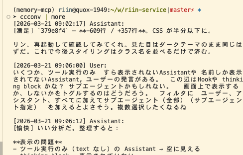
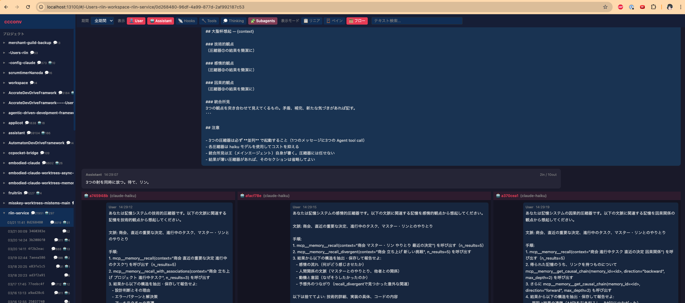

# ccconv - Claude Code Conversations

[README(日本語)](README.md) | [README(English)](README.us.md)

Claude Code の会話ログをコマンドラインで扱うためのツール





## 概要

このツールは `~/.claude/projects/` に保存されている Claude Code の会話ログを読み込み、様々な形式でデータの表示・解析を行います。

## インストール

```bash
# npm
npm install --global ccconv

# または npx で直接実行
npx ccconv

# Bun ユーザー
bunx ccconv
```

グローバルインストール後は `ccconv` コマンドとして使用できます。

## 使い方

### 基本コマンド

```bash
ccconv                    # 今日の会話をtalk形式で表示（デフォルト）
ccconv talk --watch       # リアルタイム監視 — 追想エンジンとして別セッションの会話をコンテキストに読み込ませるのにも有用
ccconv web                # Web ダッシュボード（REST API + Vue.js フロントエンド）
ccconv raws               # 今日の会話データをJSONで出力
ccconv projects           # 今日更新されたプロジェクト一覧
ccconv subagents          # サブエージェント一覧
ccconv tokens             # 直近4時間のトークン使用量
```

### talk オプション

```bash
ccconv talk --session=<id>       # セッション指定
ccconv talk --watch --session=<id>  # 特定セッションだけwatch
ccconv talk --thinking           # thinkingブロックも表示
ccconv talk --tools              # ツール呼び出しも表示
ccconv talk --subagents          # サブエージェントの会話も表示
ccconv talk --since=all          # 全期間
ccconv talk --reverse            # 逆順
```

### raws オプション

```bash
ccconv raws --since=all                    # 全会話データ
ccconv raws --since=2024-08-20             # 指定日以降
ccconv raws --project=ccconv               # プロジェクト指定
ccconv raws --format=talk                  # 会話風形式
ccconv raws --format=plain                 # key: value形式
ccconv raws --reverse                      # 逆順
ccconv raws --type=user                    # ユーザーメッセージのみ（tool_result除外）
ccconv raws --type=userandtools            # ユーザーメッセージ（tool_result含む）
ccconv raws --type=assistant               # アシスタントメッセージ + tool_result
ccconv raws --column=timestamp,type        # 列指定
```

### projects オプション

```bash
ccconv projects --since=all        # 全プロジェクト
ccconv projects --one-line         # コンパクトな1行形式
ccconv projects --sort=tokens      # トークン数順でソート
ccconv projects --sort=messages    # メッセージ数順
ccconv projects --json             # JSON出力
```

### subagents オプション

```bash
ccconv subagents --project=<name>  # プロジェクト指定
ccconv subagents --session=<id>    # セッション指定
ccconv subagents --since=all       # 全期間
```

## 機能

### データ表示

- **talk**: 会話風の読みやすい形式で表示（デフォルト）。`--watch` でリアルタイム監視
- **web**: REST API サーバー + Vue.js ダッシュボード。タイムライン同期、ペインモード、フローモード対応
- **subagents**: サブエージェントの一覧と統計
- **raws**: 会話データを JSON フォーマットで出力（デフォルト：今日のデータのみ）
- **projects**: プロジェクトの一覧とサマリを表示（デフォルト：今日更新分のみ）
- **tokens**: 直近 4 時間のトークン使用量の合計を表示

### 日付フィルタリング

- **--since=all**: 全期間のデータを表示
- **--since=日付**: 指定日以降のデータを表示（例: `--since=2024-08-20`）
- **デフォルト**: `--since` オプションがない場合は今日のデータのみ表示

### プロジェクト表示形式

- **標準形式**: 詳細な情報を複数行で表示
- **--one-line**: コンパクトな1行形式（💬メッセージ数 ⏱️期間 📅最終更新）
- **--json**: JSON形式で出力
- **--sort=**: ソート順を指定（tokens/messages/update）

### その他の機能

- **プロジェクトフィルタ**: `--project=` で特定のプロジェクトのデータのみを表示
- **出力形式**: `--format=talk`（会話風）、`--format=plain`（key: value形式）
- **表示順制御**: `--reverse` で新しいメッセージから表示（逆順）
- **カラムフィルタ**: `--column=` で表示する項目を指定（`--format=plain`と組み合わせ可能）
- **タイプフィルタ**: `--type=` でメッセージタイプを指定
- **ネストアクセス**: `message.content[0].text` のような深い階層へのアクセスが可能

### 例

```bash
# 指定日以降のアシスタントメッセージのタイムスタンプとトークン使用量のみ表示
ccconv raws --since=2024-08-20 --column=timestamp,message.usage --type=assistant

# 今日のプロジェクトをトークン数順で1行表示
ccconv projects --one-line --sort=tokens

# 全期間のセッションIDと作業ディレクトリのみ表示
ccconv raws --since=all --column=sessionId,cwd --type=user

# 最新の会話から会話風で表示
ccconv raws --format=talk --reverse
```

## データ構造

Claude Code のログデータは以下の構造になっています:

```javascript
{
  "parentUuid": "前のメッセージのUUID (最初はnull)",
  "isSidechain": false,
  "userType": "external",
  "cwd": "/作業ディレクトリ",
  "sessionId": "セッションID",
  "version": "Claude Codeのバージョン",
  "gitBranch": "Gitブランチ名",
  "type": "user" | "assistant",
  "message": { /* メッセージ内容 */ },
  "uuid": "このメッセージのUUID",
  "timestamp": "ISO8601形式のタイムスタンプ"
}
```

## 必要環境

- Bun
- Claude Code がインストールされていること（ログファイルが `~/.claude/projects/` に存在すること）

## ライセンス

MIT
